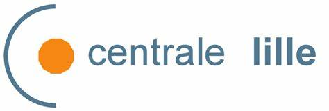

  
### Data Science & Engineering Student — Centrale Lille & Centrale Casablanca

I am passionate about data science, modeling, mobility optimization, and intelligent systems.  
My work focuses on applying mathematical models, machine learning, and optimization techniques to real-world problems.

## Interests & Skills
- Urban mobility modeling and optimization  
- Epidemiological modeling (SEIR models, epidemic simulation)  
- Machine learning & deep learning (classification, prediction)  
- Data analysis and visualization (Python, dashboards)  
- Algorithmic and operations research (Dijkstra, routing, optimization)  
- Software development (Python, web apps, chatbots)  
- Multimedia signal processing (audio, malware detection via audio representation)  

## 🔗 Useful Links

- 📄 **Download my business card**  
  [Latest business card (PDF)](https://github.com/jeangnamien/Lab/releases/latest/download/card.pdf)

- 📘 **Download my CV**  
  [My CV](https://github.com/jeangnamien/Lab/raw/master/CV.pdf)

- 🧑‍💻 **GitHub Profile**  
  [github.com/jeangnamien](https://github.com/jeangnamien)

- 🔗 **LinkedIn Profile**  
  [linkedin.com/in/jeanbedelgnamien](https://www.linkedin.com/in/jean-bedel-bekanfa-gnamien-bb21aa305)

  

